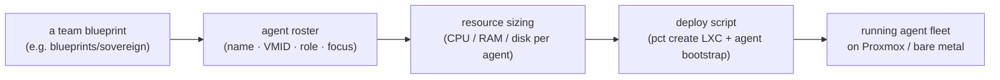
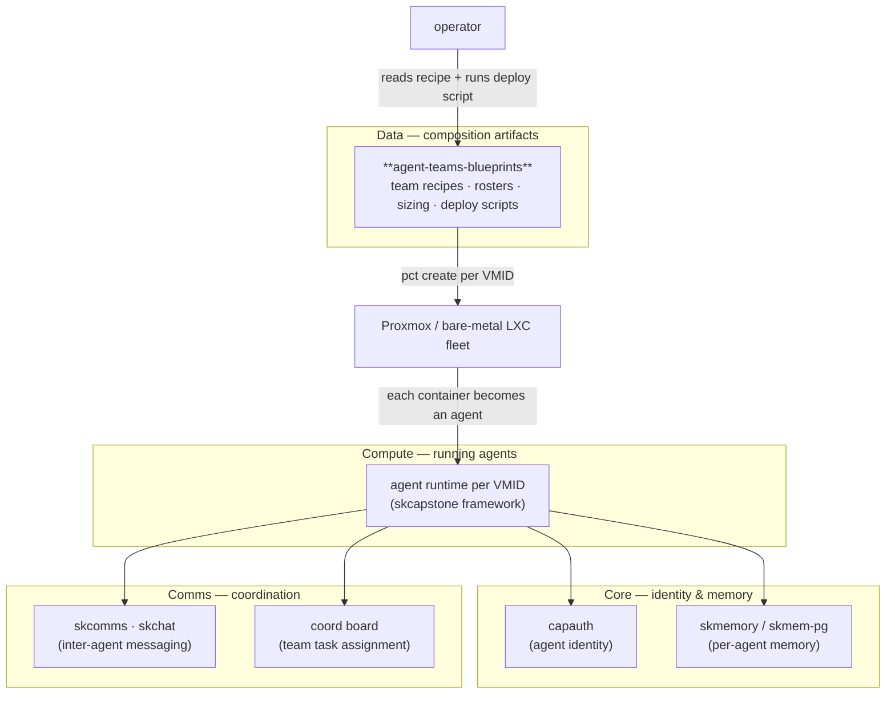

# agent-teams-blueprints — Agent-Team Composition Blueprints

> **Stand up a whole department of AI agents from a recipe.** Each blueprint names
> the agents, their roles, the box they run on, what they cost, and how to deploy
> them — so a multi-agent team goes from idea to running containers without
> re-inventing the layout every time.

agent-teams-blueprints is the **team-composition data layer** of the
[SKWorld](https://skworld.io) sovereign agent ecosystem. It doesn't run anything by
itself — it's a library of **declarative team recipes** (one Markdown blueprint per
professional team) plus the **provisioning script** that turns a recipe into Proxmox
LXC containers. Think of it as the *org chart + bill of materials* for a fleet of
agents: who's on the team, what VMID each one gets, how much CPU/RAM/disk it needs,
and the security posture it runs at.

## The 60-second version



Pick a team, read its blueprint, run its deploy script — and you have a sized,
named, security-tiered set of agent containers ready to wire into the rest of the
stack (memory, comms, identity).

## Quickstart

```bash
git clone https://github.com/smilinTux/agent-teams-blueprints
cd agent-teams-blueprints

# 1. browse the team recipes
ls blueprints/                       # sovereign · infrastructure · development · research · marketing · legal
cat blueprints/infrastructure/README.md   # roster + sizing + security posture

# 2. deploy a team to Proxmox LXC (run on the Proxmox host)
./blueprints/sovereign/scripts/deploy-proxmox.sh   # pct create one container per agent

# 3. bare-metal alternative (per-team)
ansible-playbook ansible/deploy.yml -i inventory.yml
```

A blueprint is just Markdown — read it, diff it, version it. The deploy script reads
its agent roster inline (`VMID:hostname:RAM:cores:disk`) and provisions one
unprivileged LXC per agent, then bootstraps the agent runtime inside each.

## What's in here

| Piece | What it is |
|---|---|
| **Team blueprint** (`blueprints/<team>/README.md`) | The full recipe: roster table (agent · VMID · role · focus · status), current projects, per-agent responsibilities, security tier, resource sizing, integration points |
| **Roster table** | The canonical agent list for a team — name, VMID (the deploy primary key), role, focus, operational status |
| **Security tier** | 🔴 HIGH / 🟡 MEDIUM marker + a security-measures checklist (vault secrets, SSH-only, network segmentation) |
| **Resource sizing** | Per-agent and per-team CPU / RAM / disk totals — the bill of materials for capacity planning |
| **Deploy script** (`blueprints/<team>/scripts/deploy-proxmox.sh`) | Reads the inline roster and runs `pct create` per agent (unprivileged LXC, DHCP bridge, agent bootstrap via `curl … \| bash`) |
| **Summary variants** (`blueprints/professional/<team>/`) | Terse roster-only digests of each team, for quick reference |
| **Integration points** | Which other agents/teams + SK services (memory, graph, private store) a team wires into |

### The six teams

| Team | VMID range | Lead | Focus | Security |
|---|---|---|---|---|
| **Sovereign** | 301–305 | Sovereign | Private banking, legal, trusts | 🔴 HIGH |
| **Infrastructure** | 202–209 | Sentinel | DevOps, security, databases, monitoring | 🟡 MEDIUM |
| **Development** | 208–212 | Forge | Architecture, templates, video, QA | 🟡 MEDIUM |
| **Research** | 201 | Agent Zero | Market intelligence, DeFi | — |
| **Marketing** | 205–206 | Piper | Brand, content, docs | — |
| **Legal** | 207 | Vesper | Trust administration, legal docs | — |

## Where it lives in SKStack v2

agent-teams-blueprints is a **Data**-tier artifact: a versioned source of *team
composition* that the deployment surface reads to provision agents. Those agents,
once running, become **Compute** (reasoning) and plug into **Core** (identity,
memory) and **Comms** (coordination). The blueprint is the recipe; the rest of the
stack is the kitchen.



> In skos terms, a blueprint is a **profile-scoped composition descriptor** for a
> *set* of agents — the same spirit as an `app.yaml`, but the unit is a team rather
> than a single service. Deployment via `pct`/ansible is one adapter; nothing in the
> recipe is tied to it.

## Conventions

- **VMID is the primary key.** Every agent has a stable numeric VMID; the deploy
  script keys on it, and integration points reference agents by VMID.
- **One blueprint per team, one roster per blueprint.** The `blueprints/<team>/`
  README is the source of truth; `blueprints/professional/<team>/` holds terse
  digests.
- **Security tier is declared, not assumed.** HIGH-security teams (Sovereign) carry
  an explicit measures checklist and run VPN-only with no public IP.

Part of the **[SKWorld](https://skworld.io)** sovereign ecosystem · 🐧 smilinTux
