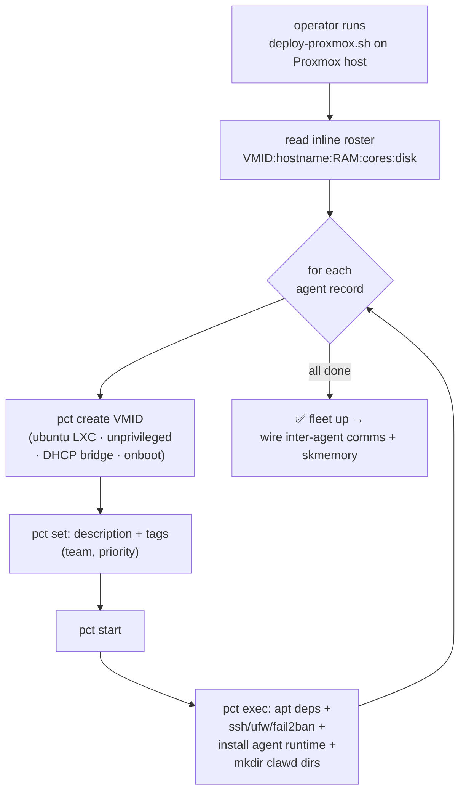
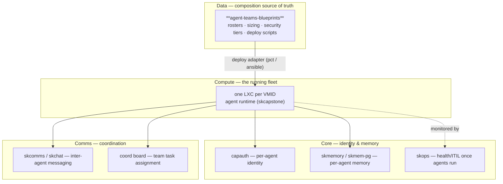

# Architecture — agent-teams-blueprints

agent-teams-blueprints is **data, not a daemon.** It stores *what a team is made of*
in a consistent Markdown shape, and ships a thin provisioning script that turns that
data into running containers. This doc covers the blueprint schema, how a blueprint
is consumed end-to-end, the content map, and where the artifact sits in SKWorld.

## 1. The blueprint schema

Every team blueprint (`blueprints/<team>/README.md`) follows the same structure.
That regularity *is* the schema — it's what makes the recipes diffable, comparable,
and (potentially) machine-readable.

| Section | Purpose | Required fields |
|---|---|---|
| **Title + one-liner** | Team name, emoji, scope | — |
| **Overview** | Prose intro + **security tier** (🔴 HIGH / 🟡 MEDIUM) | security level |
| **Team Composition** | The roster table — the canonical agent list | `Agent · VMID · Role · Focus · Status` |
| **Current Projects** | What the team is actively working on | bullet list |
| **Responsibilities** | Per-agent duty breakdown | one sub-section per agent |
| **Security Measures** | Checklist (HIGH-security teams) | `[x]` checklist |
| **Quick Start** | Deploy commands | Proxmox LXC + bare metal |
| **Resource Requirements** | Capacity bill of materials | per-agent + per-team CPU/RAM/disk |
| **Integration Points** | Cross-team + SK-service wiring | bullet list |

The **roster table** is the load-bearing part. `VMID` is the primary key: it's
globally unique across teams, stable, and what every downstream consumer (deploy
script, integration references, capacity math) keys on.

```
| Agent     | VMID | Role        | Focus                          | Status         |
|-----------|------|-------------|--------------------------------|----------------|
| Sovereign | 301  | Team Lead   | Banking, estates, legal coord  | Pending        |
| Regent    | 302  | Legal Rsrch | Common law, UCC, affidavits    | Pending        |
```

Two granularities exist for each team:

- `blueprints/<team>/README.md` — the **full** blueprint (all sections above).
- `blueprints/professional/<team>/README.md` — a **digest**: title, overview,
  roster table, and a pointer to `deployment.md`. Useful for a one-glance roster.

## 2. How a blueprint is consumed (the deploy flow)

The only executable consumer in the repo is the Proxmox deploy script. It encodes
the roster *inline* as `VMID:hostname:RAM:cores:disk` records, then provisions one
unprivileged LXC per agent and bootstraps the agent runtime inside.



Key properties of the flow:

- **Idempotent unit = one VMID.** Each agent is created independently; the loop is
  the whole orchestration. There is no shared state between agents at provision time.
- **Security baked into the container.** Bootstrap installs `ufw` + `fail2ban`,
  enables SSH, and runs unprivileged (`--unprivileged 1`) with `nesting=1,keyctl=1`.
- **Runtime is pluggable.** The agent runtime is installed via
  `curl -fsSL https://install.openclaw.ai | bash`; the blueprint stays
  runtime-agnostic — swap the bootstrap and the same roster deploys elsewhere.
- **Bare-metal adapter.** The blueprints also document an `ansible-playbook` path as
  an alternative to `pct`; the roster is the same, only the provisioning adapter
  changes.

## 3. Source / content map

| Path | Role |
|---|---|
| `README.md` | Repo overview, the six-team table, deploy quickstart |
| `blueprints/sovereign/README.md` | Full Sovereign blueprint (5 agents, 🔴 HIGH security) |
| `blueprints/sovereign/scripts/deploy-proxmox.sh` | The reference deploy script (inline roster → `pct create` loop) |
| `blueprints/infrastructure/README.md` | Infrastructure team (Sentinel/Rook/Dev-Alpha, 🟡 MEDIUM) |
| `blueprints/development/README.md` | Development team (Forge + Dev-Beta/Gamma/Delta) |
| `blueprints/research/README.md` | Research team (Agent Zero) |
| `blueprints/marketing/README.md` | Marketing team (Piper, Chronicle) |
| `blueprints/legal/README.md` | Legal team (Vesper, transitioning to Sovereign support) |
| `blueprints/professional/<team>/README.md` | Terse roster digests of each team |
| `docs/ARCHITECTURE.md` | This document |

> Note: the deploy script currently lives under `blueprints/sovereign/scripts/`. Each
> blueprint's Quick Start references a per-team `./scripts/deploy-proxmox.sh`; the
> Sovereign script is the canonical template the others follow (same inline-roster
> pattern, different VMID/hostname records).

## 4. Where it lives in the SKWorld ecosystem

A blueprint is a **composition artifact** — sovereign infrastructure-as-data. It is
read by the deployment surface to bring agents up; once running, those agents become
the active fleet that plugs into the rest of the 4 C's.



**Relationship to skos:** skos describes a *single* sovereign service via `app.yaml`
(capability → adapter, per profile). A team blueprint is the natural plural — a
*composition descriptor for a set of agents*, sized and security-tiered, with the
`pct`/ansible deploy as one concrete adapter. The blueprint says **what** the team
is; skos-style resolution says **how** each member is realized for a given profile.

## 5. Extending

- **Add a team:** create `blueprints/<team>/README.md` following the schema in §1,
  allocate a non-overlapping VMID range, and add a `scripts/deploy-proxmox.sh` with
  the team's inline roster.
- **Change a team's size:** edit the roster table and the matching record in the
  deploy script — keep VMIDs stable so integration references don't break.
- **Make it machine-readable:** the consistent table shape means a thin parser could
  emit the roster as YAML/JSON for an `app.yaml`-style renderer; today the script
  carries the roster inline as the single source consumed at deploy time.

Part of the **[SKWorld](https://skworld.io)** sovereign ecosystem · 🐧 smilinTux
